# python基础语法
&copy; 代宏全 2024.3.21-2099.1.1

---
『尼采：其实人跟树一样的，越是向往高处的阳光，他的根就要越要向下，伸向地底深处』

---

## 目录

## 壹.[print函数](#p1)
## 贰.[变量和赋值](#p2)
## 叁.[数据类型](#p3)
## 肆.[数据应用](#p4)
## 伍.[数据转换](#p5)
## 陆.[条件判断](#p6)
## 柒.[条件嵌套](#p7)
## 捌.[列表](#p8)
## 玖.[字典](#p9)
## 拾.[循环](#p10)
## 拾壹.[布尔值](#p11)
## 拾贰.[函数](#p12)
## 拾叁.[bug](#p13)
## 拾肆.[类与对象](#p14)
## 拾伍.[编码](#p15)
## 拾陆.[文件](#p16)
## 拾柒.[模块](#p17)
## 拾捌.[csv](#p18)

<h2 id='p1'>壹.print函数</h2>

1. 无引号

打印数字或公式结果
> print(520)

2. 单引号/双引号

打印字符串,原样输出
```
print('单引号')
print("双引号")
```

3. 三引号

打印多行，可以识别换行和空格
```
# 打印皮卡丘
print('''    へ        /|
            /\        ∠＿/
           /　│　　  ／　／
          │　Z ＿,＜　／　　 /`ヽ
          │　　　　　ヽ　　 /　　〉
          Y　　　　　`　 /　　/
          ｲ●　､　●　　⊂⊃〈　　/
          ()　 へ　　　　|　＼〈
          >ｰ ､_　 ィ　 │ ／／
           / へ　　 /　ﾉ＜| ＼＼
          ヽ_ﾉ　　(_／　 │／／
          　7　　　　　　　|／
           ＞―r￣￣`ｰ―＿
      ''')
```

4. 转义字符

\\+转义符
> \\n 换行

<h2 id='p2'>贰.变量和赋值</h2>

命名规范:
只能是一个词;
只能包含字母、数字和下划线
不能以数字开头
尽量描述数据内容

赋值符号`=`
【局部变量】在一个函数内定义的变量仅能在函数内部使用（局部作用域）
【全局变量】在所有函数之外赋值的变量，可以在程序的任何位置使用（全局作用域）
在函数内部定义全局变量 添加 global

```
name = '皮卡丘'
def egg():    
    global quantity
#global语句将变量quantity声明为全局变量
    quantity = 108
egg()
print(quantity)
```
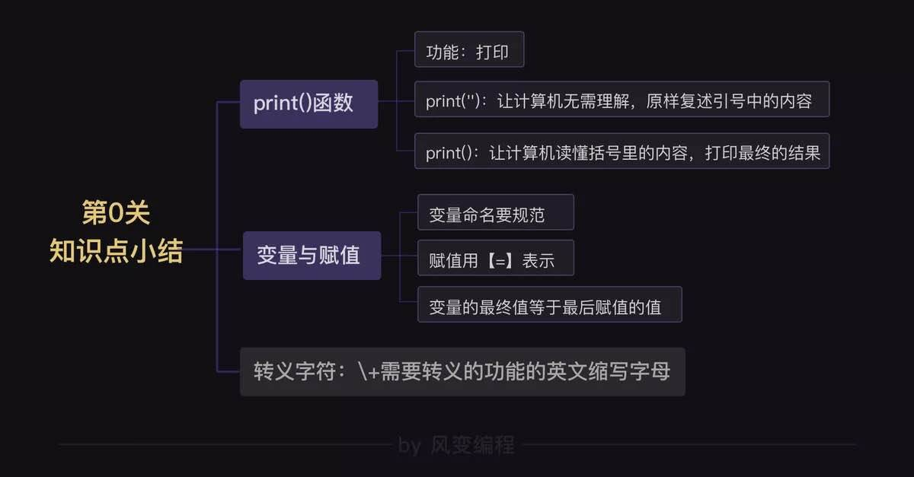

<h2 id='p3'>叁.数据类型</h2>

1. 字符串str

被【单/双/三引号】这层皮括起来的内容，就表示是字符串类型
```
'1' 
"1"
'''1'''
``` 

2. 整数int

没有小数点的数字
> 1 2 3

3. 浮点数float

带小数点的数字,运行结果存在误差（进制转换）
> 1.2

<h2 id='p4'>肆.数据应用</h2>

1. 四则运算

运算优先级与数学计算优先级一样，从左往右，括号先算，乘除在加减前
```
+ 加   1 + 1 = 2
- 减   2 - 1 = 1
* 乘   3 * 2 = 6
/ 除   4 / 2 = 2
% 取余 5 % 2 = 1
** 幂运算 2 ** 3 = 8
// 整除 11 // 2 = 5   11.0 / 2 = 5.0
```

2. 字符串拼接

字符串拼接使用`+`
> print('皮' + '卡' + '丘')

3. 数据的类型

type()函数
```
print(type(1))  输出为 <class 'int'>
print(type(1.1)) 输出为 <class 'float'>
print(type('1')) 输出为 <class 'str'>
```

<h2 id='p5'>伍.数据转换</h2>

1. 转换为字符串

使用str()或用引号包裹
```
str(1)
print('1')
```

2. 转换为整数

使用int(),浮点字符串不能转换为整数，浮点数可以
```
number1 = '6'
number2 = 1.8
print(int(number1)+int(number2))
```
str()、 和float()

3. 转换为浮点数

```
height = 188.0
weight = 180.0
age = '89'
print(float(height))
print(float(weight))
print(float(age))
```
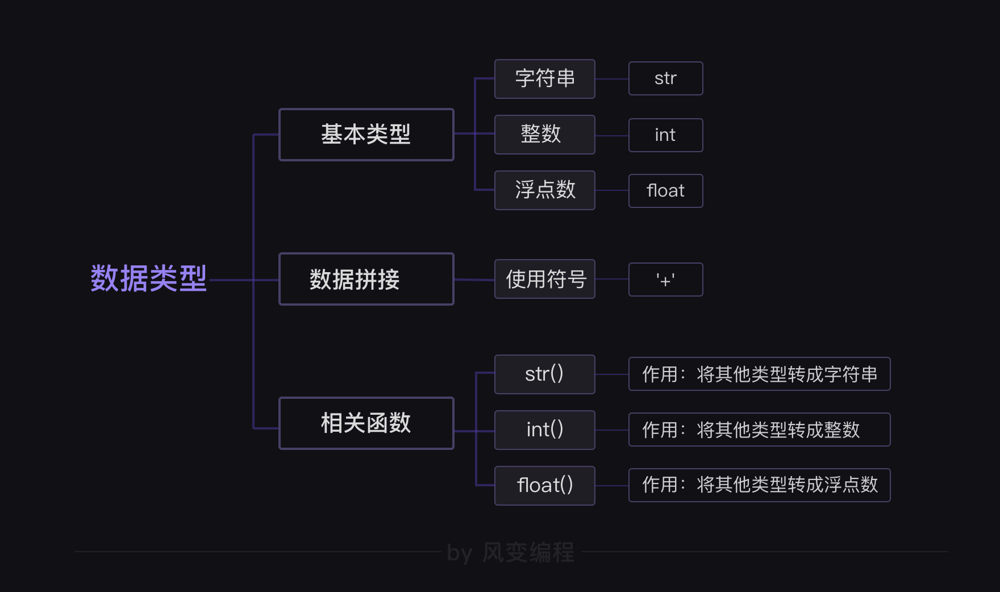

<h2 id='p6'>陆.条件判断</h2>

1. 单向判断 if

如果...就...，注意缩进（空格）
```
if 1 > 2:
    print('1' + '大于2')
```

2. 双向判断 if...else...

如果…不满足，就…
```
if 1 > 2:
    print('1' + '大于2')
else:
    print('1' + '不大于2')
```

3. 多向判断 if...elif...else...

如果…或者是...不满足，就…
```
if 1 > 2:
    print('1' + '大于2')
elif 1 == 2:
    print('1' + '等于2')    
else:
    print('1' + '小于2')
```

<h2 id='p7'>柒.条件嵌套</h2>

在基础条件底下增加额外的条件判断
```
if 100 > 1:
    print('100大于1')
    if 100 > 20:
        print('100大于20')
```
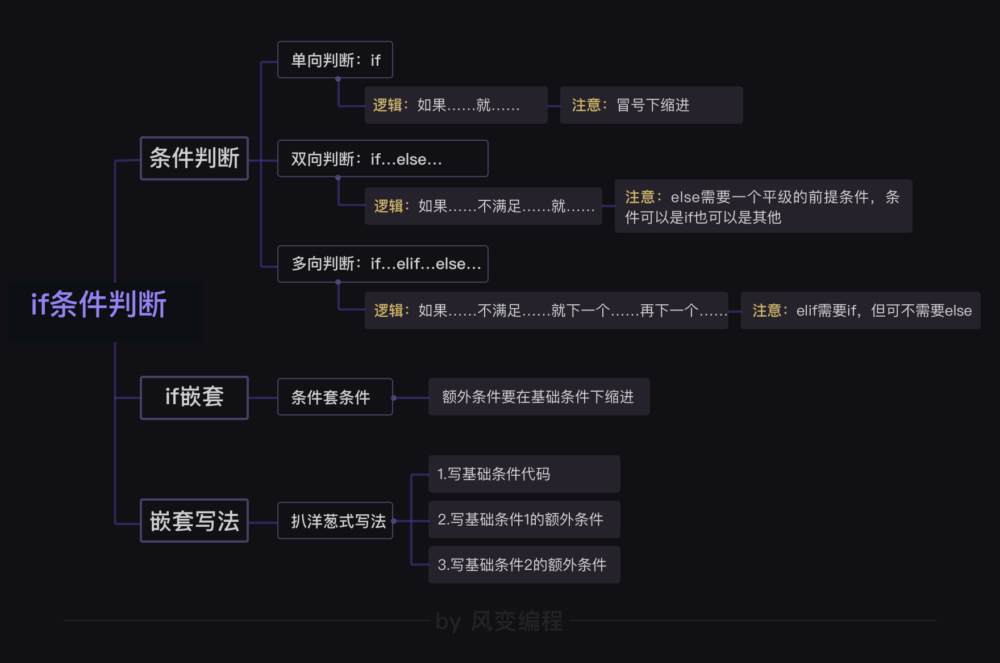

<h2 id='p8'>捌.列表</h2>

1. 列表定义

中括号包裹列表元素，使用`，隔开，列表元素可以是各种数据类型，空列表使用[]

```
# 列表排序打印
A=[91, 95, 97, 99]
B=[92, 93, 96, 98]
C = A + B
C.sort()
print('列表排序打印：%s' %C)
print('列表最大值：%s' %max(C))
print('列表最小值：%s' %min(C))
print('列表长度：%s' %len(C),end='')
```


2. 提取列表元素

列表索引从0开始，提取时使用列表名[索引]
提取多个元素（切片）使用列表名[参数1:参数2:参数3]
参数1表示从索引参数1开始提取，负数表示从后往前索引，省略表示从索引0开始
参数2表示提取至参数2索引（不包含参数2索引），负数表示从后往前索引，省略表示提取所有
参数3表示间隔参数3，负数表示从后往前索引，省略表示间隔1个索引，[::-1]表示列表反序
```
# 提取第1个元素
print(student[0])
# 提取多个元素（切片）
# 提取第二个元素至结束
print(student[1:])
# 反序
print(student[::-1])
```

3. 添加列表元素
```
# 从末尾添加列表元素使用append()
student.append('小金')
# 从任意索引处插入 insert(索引位置,列表元素)
# 从第二个索引出插入小金
student.insert(1,'小金')
```

4. 删除元素
```
# del + 列表/列表切片
del student[2]
```

<h2 id='p9'>玖.字典</h2>

使用{}包裹的键值对(键必须是不可变元素)，用,分隔字典元素,空字典{}
```
# 字典
scores = {'小明':90,'小红':95,'小兰':88}
# 添加字典元素
scores['小金'] = 77
# 删除元素与列表类似，使用del
del scores['小金']
# 字典元素多类型提取,打印第二组的第一个元素小强
studentsGroup = {
    '第一组':['小明','小红','小刚','小美'],
    '第二组':['小强','小兰','小伟','小芳']
    }
print(studentsGroup['第二组'][0])
```

<h2 id='p10'>拾.循环</h2>

重复执行
continue 跳过当次循环
break 终止循环
pass 什么都不做
else 结束循环时没有碰到break语句，就会执行循环后面的else语句，否则就不会执行
for循环：循环的工作量确定
while：工作量不确定
for格式：for 元素名 in 数据集合
数据集合：序列、元组、字符串、列表、字典等
```
# 打印从0至3（不包含3）的序列
for i in range(3):
    print(i)
# 打印列表
for i in [3,2,1]:
    print(i)
# 打印字典
for j,k in {'小明':88,'小红':97}.items():
    print(j)
    print(k)
```
while格式：while 条件:
```
a = 0
while True:
    print(a)
    a += 1
    pass
    if a < 3:
        continue
    else:
        break
else:
    print('你没有触发break语句，导致else语句生效。')
```

<h2 id='p11'>拾壹.布尔值</h2>

布尔值:True和False
查看bool值`bool()`
比较运算符：>、>=、<、<=、==、!=、
布尔运算
and 全真为真
or 至少一个真时为真
not 取反，真时为假
in 在/包含
not in 不在/不包含

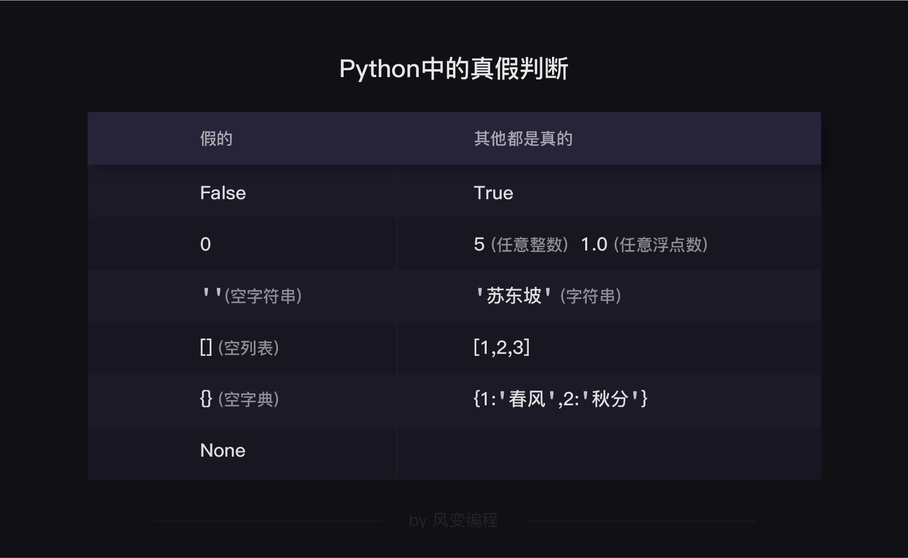

<h2 id='p12'>拾贰.函数</h2>

组织好的、可以重复使用的、用来实现单一功能的代码

1. 定义函数 

def 函数名(参数1,参数2,...参数n): 函数体 return 语句
如果没有return，实际是return None
```
# 无参函数
def pika1():
    print('我最喜爱的神奇宝贝是皮卡丘')
# 多参求和函数
def sum(x,y):
    return x + y
```
2. 调用函数

函数名(参数1,参数2,...参数n)
```
# 定义打印圣诞树函数并调用
def tree(Height):
    print('Merry Christmas!')
    for i in range(Height):
        print((Height-i)*2*' '+'o'+ i*'~x~o')
        print(((Height-i)*2-1)*' '+(i*2+1)*'/'+'|'+(i*2+1)*'\\')
tree(4)
tree(8)
```

3. 位置参数、不定长参数、默认参数

位置参数：按位置顺序传递
不定长参数：不确定参数个数
默认参数：给参数默认值，默认参数必须放在位置参数和不定长参数之后
```
# 位置参数 appetizer,course 不定长参数：不确定参数个数 *barbeque，默认参数 dessert
def menu(appetizer,course,*barbeque,dessert='绿豆沙'):
    print('一份开胃菜：' + appetizer)
    print('一份主食：' + course)
    print('一份甜品：' + dessert)
    for i in barbeque :
        print('一份烤串：' + i)
menu('话梅花生','黄焖鸡米饭','牛肉串','羊肉串')
```

4. 返回多个参数（元组tuple[]）

```
# 返回多个参数
def lover(name1,name2):
    face = name1 + '的脸蛋'
    body = name2 + '的身材'
    return face,body
a=lover('李若彤','林志玲')
print('我的梦中情人：'+a[0]+' + '+a[1])
```

<h2 id='p13'>拾叁.bug</h2>

【bug】故障（非预期的输出）
【debug】排除故障

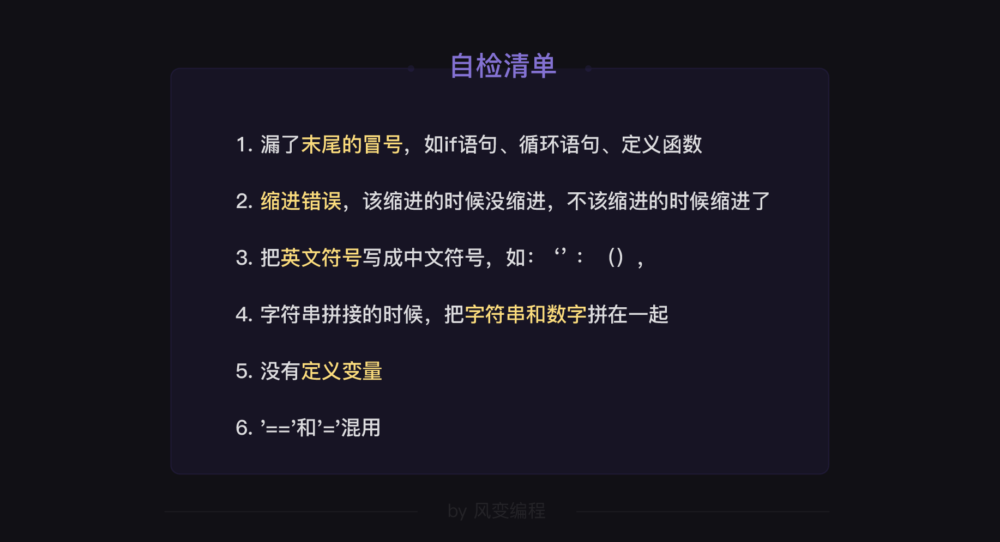
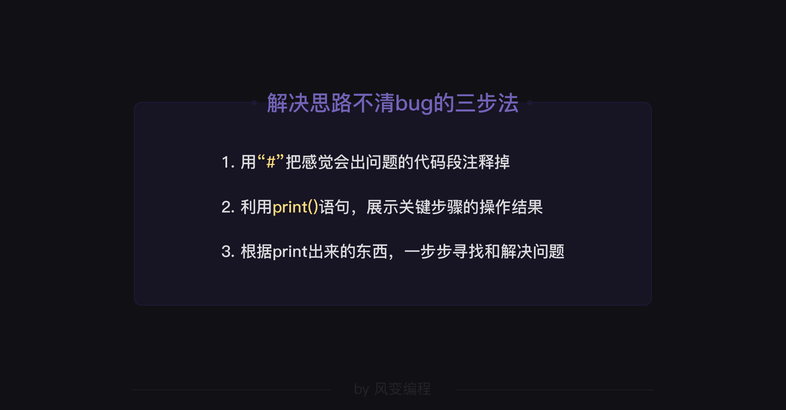

<h2 id='p14'>拾肆.类与对象</h2>

1. 类

做一道西红柿炒鸡蛋
面向过程：使用函数/方法一步步按过程实现。主要用到的是“函数”知识，将每个过程步骤打包成函数，再依次调用。例如自己按照炒菜的步骤亲手制作一道西红柿炒鸡蛋
面向对象：使用类，让对象实现。例如制作一台炒菜机器人，然后告诉机器人做一道西红柿炒鸡蛋。

【类】是【对象】的模板，是一个函数包。类中可以放置函数和变量，然后类中的函数可以很方便的使用类中的变量。
语法：class ClassName(): 类名一般首字母要大写，(): 不能丢 
```
# 语法：创建一个名为“ClassName”的类，类名一般首字母要大写，(): 不能丢   
class Dog():
    # 如定义一个名为'狗'的类，可以写成class Dog():
    # 定义属性
    dogname = '小黑'
    # 规范：class语句后续的代码块要缩进  
    # 定义类中的函数barking
    def barking():
        print('叫声：汪')
    
    # 如果类方法要调用类属性，需要使用@classmethod声明函数是类方法，使用参数cls作为第一个参数，使用cls.属性名调用
    @classmethod
    def 自我介绍(cls,age):
        print('我的名字是%s年龄是%s' % (cls.dogname,age))

# 这里需要用 类名+属性名
print('小狗的名字：%s' % Dog.dogname) 
# 修改类属性 类名.变量名=新值
Dog.dogname = '小白' 
# 调用类属性
print('小狗的名字：%s' % Dog.dogname) 
# 调用类方法
Dog.barking()
Dog.自我介绍(1)
```

2. 对象

【类】这种模板层级的本身也是【对象】，但并不是【实例对象】
模具变成产品，也就是从【类】变成【实例对象】的过程，就叫做【实例化】
实例化语法：实例名 = 类名()
类方法可以重写，实例方法不可以
```
class 类():
    属性 = '属性'
    def 原始函数(self):
        print('我是原始函数！')

def 新函数(self):
    print('我是重写后的新函数!')

a = 类()  # 实例化
a.原始函数()

# 类属性修改会影响所有未重新赋值的实例属性，实例属性修改只会影响自己本身
a.属性 = '属性3'
类.属性 = '属性2'
# 这里会输出重新赋值的实例属性值，如果实例属性没有重新赋值，则会输出重新赋值的类属性值
print('我是实例属性：' + a.属性)

# 用新函数代替原始函数，也就是【重写类方法】，但不可以实例队形.原始函数 = 新函数
类.原始函数 = 新函数

# 现在原始函数已经被替换了
a.原始函数()
```

3. 类的继承

子类继承父类
class 子类(父类):
多重继承要求父类是平等的关系
```
class 成绩单_旧():
    def __init__(self,学生姓名,语文_成绩,数学_成绩):
        self.学生姓名 = 学生姓名
        self.语文_成绩 = 语文_成绩
        self.数学_成绩 = 数学_成绩

    def 打印成绩单(self):
        print(self.学生姓名 + '的成绩单如下：')
        print('语文成绩：'+ str(self.语文_成绩))
        print('数学成绩：'+ str(self.数学_成绩))

    def 打印平均分(self):
        平均分 = (self.语文_成绩 + self.数学_成绩)/2
        print(self.学生姓名 + '的平均分是：' + str(平均分))
# 子类继承父类
class 成绩单_新(成绩单_旧):
    def 打印总分(self):
        总分 = self.语文_成绩 + self.数学_成绩
        print(self.学生姓名 + '的总分是：' + str(总分))


实例_旧 = 成绩单_旧('王明明',99,88)
实例_旧.打印成绩单()
实例_旧.打印平均分()

实例_新 = 成绩单_新('王明明',99,88)
实例_新.打印成绩单()
实例_新.打印平均分()
实例_新.打印总分()
```


<h2 id='p15'>拾伍.编码</h2>

encode()和decode()
用来存放一位0或1，就是计算机里最小的存储单位，叫做【位】，也叫【比特】（bit）。
我们规定8个比特构成一个【字节】（byte），这是计算机里最常用的单位。
1B(byte)  = 8 bit
1KB = 1024B = 1024 byte
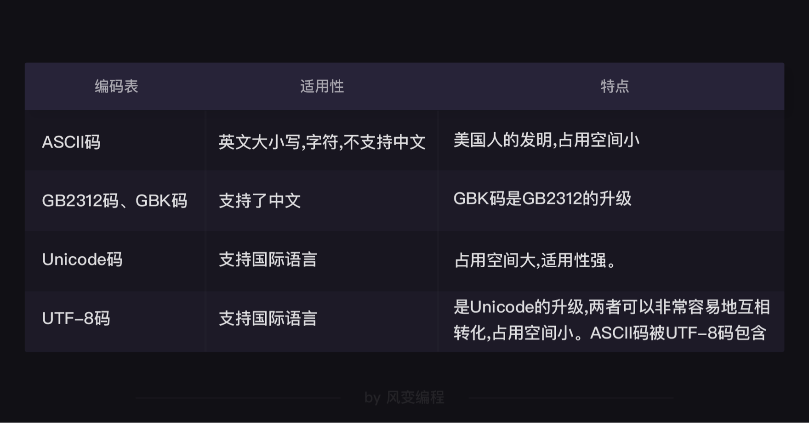


【编码】encode()；反之，就是【解码】decode()
'你想编码的内容'.encode('你使用的编码表')
'你想解码的内容'.decode('你使用的编码表')
```
print('你好'.encode('utf-8'))
print('你好'.encode('gbk'))
print(b'\xe4\xbd\xa0\xe5\xa5\xbd'.decode('utf-8'))
print(b'\xc4\xe3\xba\xc3'.decode('gbk'))
# b'\xc4\xe3\xba\xc3'，这代表它是bytes（字节）类型的数据.
# \x是分隔符，用来分隔一个字节和另一个字节。
# 类似网址中的%：https://www.baidu.com/s?wd=%E5%90%B4%E6%9E%AB
# UTF-8编码的字节就一定要用UTF-8的规则解码，其他编码同理
print(type('你好'))
print(type(b'\xc4\xe3\xba\xc3')) 
# 字符：'1'， '中'， 'a'， '$'， '￥' 。
# 字节则是计算机中存储数据的单元，一个8位的二进制数
```

<h2 id='p16'>拾陆.文件</h2>

1. 读


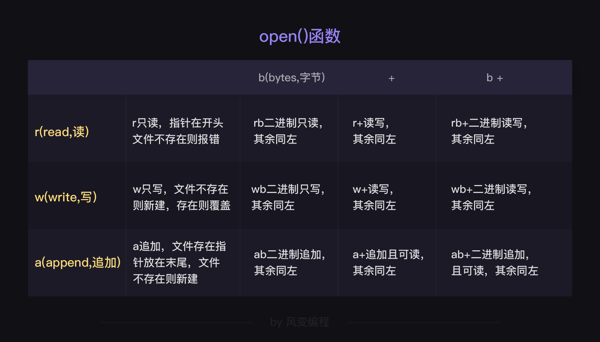
打开文件=>读文件=>关闭文件
```
# 第一个参数是文件的保存地址,
file1 = open('./src/abc.txt','r',encoding='utf-8') 
filecontent = file1.read() 
print(filecontent)
file1.close() 
```

2. 写

打开文件=>写文件=>关闭文件
```
# 第一个参数是文件的保存地址,第二个参数是读写模式，第三个参数是编码
file1 = open('D:/study/visualStudioFile/LoveStudy/python/src/abc.txt','a',encoding='utf-8') 
file1.write('张无忌\n')     
file1.write('宋青书\n')     
file1.close()   
```

3. with as

避免忘记关闭文件，可以使用 with as
```
# 普通写法
file1 = open('./src/abc.txt','a') 
file1.write('张无忌') 
file1.close()

# 使用with关键字的写法
# 避免忘记关闭文件，可以使用 with as
#with open('文件地址','读写模式') as 变量名:
with open('./src/abc.txt','a',encoding='utf-8') as file1:
    #格式：冒号不能丢
    file1.write('张无忌') 
    #格式：对文件的操作要缩进
    #格式：无需用close()关闭

# file1.read() 读取全文
# file1.read(n) 读取n字节，可以连续读取，每读取一次，指针停留在读取后的位置
# file1.readline() 读取行,指针停留在读取后的位置
# file1.readlines() 读取所有行,返回一个列表，每个值是文本每一行
with open('./src/abc.txt','r',encoding='utf-8') as file1:
    #读取行，指针停留在读取后的位置。在读取时会跳过已读的这一行
    file_line = file1.readline()
    #读取所有行，在读取时会跳过已读的行
    file_lines = file1.readlines()
    # 遍历所有行
    for i in file_lines:
        # 将行数据按空格拆分
        data =i.split()  
    print(file_line)
    print(file_lines)
# file1.write(fileStr) 写全文
# file1.writeline(fileStr) 写一行,指针停留在写后的位置
# file1.writelines() 以列表形式写所有行,列表的每个值是文本每一行
```

<h2 id='p17'>拾柒.模块</h2>

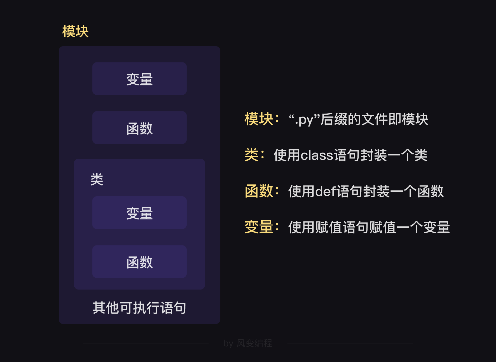 

每次运行的代码，本质上都是在运行一个名为main.py的程序文件
封装模块的目的也是为了把程序代码和数据存放起来以便再次利用。
如果封装成类和函数，主要还是便于自己调用，
但封装了模块，我们不仅能自己使用，文件的方式也很容易共享给其他人使用。
import语句导入其他py文件
from … import …语句可以让你从模块中导入一个指定的部分到当前模块
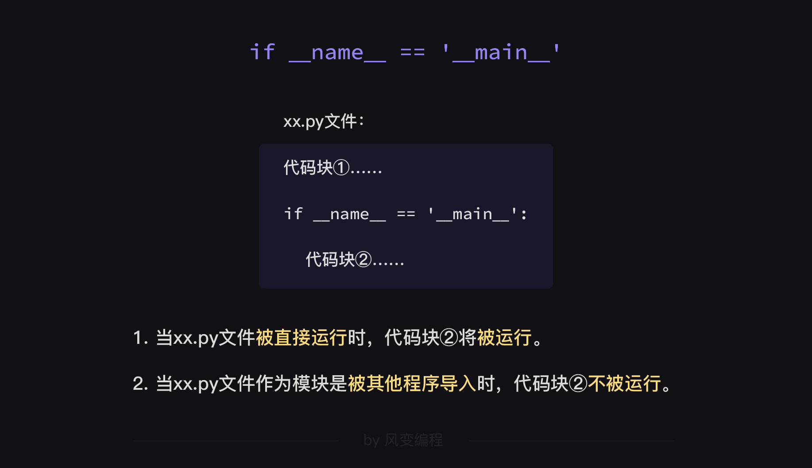

```
# 引入同一目录的模块
import testModel,random
testModel.hi()
# 引入同一目录的模块并使用别名
import testModel as test
test.hi()
# from … import …语句可以让你从模块中导入一个指定的部分到当前模块
from testModel import hi
hi()
# 程序的入口【if __name__ == '__main__'】

a = random.random()  # 随机从0-1之间（包括0不包括1）抽取一个小数
print(a)

# 随机从0-100（包括0和100）之间抽取一个数字
a = random.randint(0,100)  
print(a)
# 随机从字符串，列表等对象中抽取一个元素（可能会重复）
a = random.choice('abcdefg')  
print(a)
# 随机从字符串，列表等对象中抽取多个不重复的元素
a = random.sample('abcdefg', 3) 
print(a)
# “随机洗牌”，比如打乱列表
items = [1, 2, 3, 4, 5, 6]  
random.shuffle(items)
print(items)
# dir()函数查看一个模块，看看它里面有什么变量、函数、类、类方法
print(dir(random))
# dir(x)，可以查询到x相关的函数，x可以是模块，也可以是任意一种对象
a = ''  # 设置一个字符串
print('字符串：')
print(dir(a))    # 把字符串相关的函数展示出来
```

<h2 id='p18'>拾捌.csv</h2>

csv是一种文件格式，你可以把它理解成“简易版excel”。
学会了csv模块，你就可以用程序处理简单的电子表格了

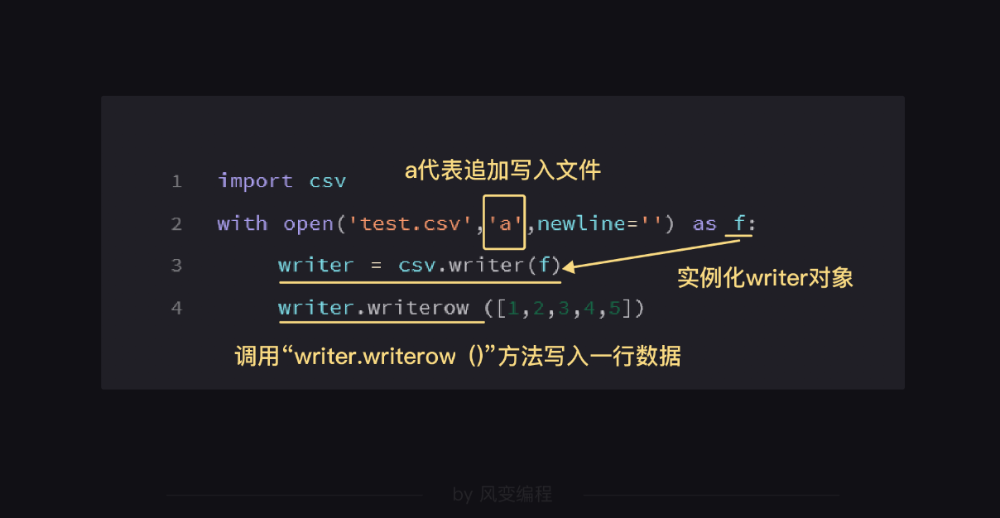

```
# dir()函数会得到一个列表，用for循环一行行打印列表比较直观
# 中文教程：https://yiyibooks.cn/xx/python_352/library/csv.html#module-csv
for i in dir(csv):
    print(i)

with open('test.csv','a', newline='',encoding='utf-8') as f:
    writer  = csv.writer(f)
    writer.writerow(['4', '猫砂', '25', '1022', '886'])
    writer.writerow(['5', '猫罐头', '18', '2234', '3121'])

with open("test.csv",'r',newline = '',encoding='utf-8')  as f:
    reader = csv.reader(f)
    #使用csv的reader()方法，创建一个reader对象
    for row in reader: 
    #遍历reader对象的每一行
        print(row)
```


